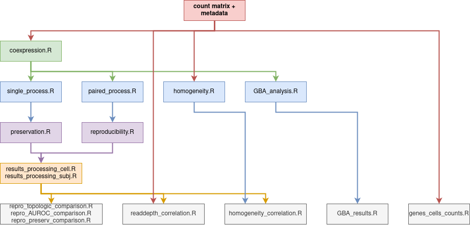

# Master 2 in Bioinformatics, University of Rennes, Internship project.

Script used in my 2023 Master degree internship project.

This aimed to build co-expression network from single cell RNA-seq data.

Input to the co-expression computation is a R `list` with 2 elements :
 * (named ctmat) A read counts matrix with cells in column (named) and genes in rows (named).
 * (named meta) A data table with a row for each cells and column with : cells labels (corresponding to count matrix columns names), cell-types, subject labels. columns names have to respectevely be cell, cell_type, and subject.

# Workflow Schema

